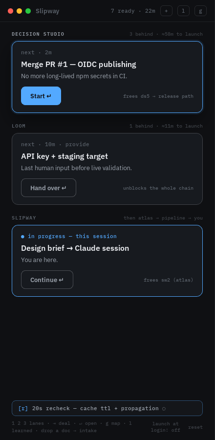

# Slipway

[](https://github.com/fieldstatenz/slipway/actions/workflows/ci.yml)
[](LICENSE)

The externalized mental model — a dependency-aware task board where every task
carries a learn-loop, so execution builds retained capability instead of just
clearing a list. Built ADHD-first: one focus card per lane, never a wall of
list items; the next action is always dealt for you, and everything else stays
out of the way until asked for.

> Execution is the method; retained capability is the point.

Slipway is a local-first Tauri desktop app: Rust + SQLite behind a
React/TypeScript sidebar-shaped window (440px wide — it lives at the edge of
your screen). No network, no server, no accounts.

<p align="center">
  
</p>

## Quickstart

Prerequisites: [Rust](https://rustup.rs), [Node 22+](https://nodejs.org),
[pnpm](https://pnpm.io), and on Linux the
[Tauri system dependencies](https://tauri.app/start/prerequisites/).

```sh
pnpm install
pnpm tauri dev
```

First run greets you with an empty board: load the bundled launch graph, or go
straight to intake (drop a doc on the window, or press `i`) to build your own.

## The learn-loop

Every task you execute carries a small loop, and the loop is the product:

1. **Before** — a 20-second framing of why this task teaches something.
2. **Steps** (or a decision) — do the work; commands are copyable, inline
   concepts are one tap away and strictly opt-in.
3. **Capture** — ONE TAP: a single multiple-choice question graded on the
   spot. Right builds a streak; wrong shows _why_ (the why is the win) and
   comes back in ~1 day; skipping leaves the concept **hollow** (`◌`) — it
   will keep offering itself until you answer.

Captured concepts land in the **ledger** (`l`) and resurface as **20-second
rechecks in passing**: one at a time, in the footer, only when nothing else is
going on. Intervals follow the streak — 4d, then doubling (4d × 2^(streak−1)),
capped at 30d; a miss pulls the concept back in ~1d; hollow is due
immediately. Concepts can also ride a task (`with ds5`) and resurface when
that task completes instead of on the clock. Full rules:
[docs/resurfacing-scheduler.md](docs/resurfacing-scheduler.md).

## Keyboard map

| Key     | Where             | Does                                        |
| ------- | ----------------- | ------------------------------------------- |
| `1`–`9` | board             | select lane                                 |
| `Tab`   | board             | deal the lane's next card                   |
| `Enter` | board             | open the focus card's drawer                |
| `Enter` | drawer (steps)    | done — next step / on to the question       |
| `1`–`2` | drawer (decision) | make the call                               |
| `1`–`4` | capture / recheck | answer the question                         |
| `s`     | capture           | skip — stays hollow, will ask again         |
| `Enter` | after a miss      | got it — continue                           |
| `Esc`   | anywhere          | park the drawer / close the overlay or quiz |
| `g`     | board             | toggle the map (dependency chains)          |
| `l`     | board             | toggle the ledger (learned concepts)        |
| `i`     | board             | toggle intake                               |
| `r`     | board             | take the offered 20s recheck                |

## JSON import schema

Intake accepts a graph JSON payload (the same schema as
[`seed/launch-graph.json`](seed/launch-graph.json)). Version `1`, four
top-level collections:

```jsonc
{
  "version": 1,
  "projects": [
    { "key": "ds", "name": "DECISION STUDIO", "full_name": "decision-studio", "custom": false },
  ],
  "concepts": [
    // resurface_hint: "~4d"/"30d" (display) or "with ds5"/"at ds7" (rides that task)
    { "id": "oidc", "name": "oidc trusted publishing", "resurface_hint": "with ds5" },
  ],
  "tasks": [
    {
      "id": "ds1",
      "project": "ds",
      "pr": 1, // priority order within the lane
      "owner": "you", // or "atlas" / "pipeline" — only your tasks are dealt
      "kind": "action", // or "decision" (options) / "provide"
      "effort_min": 2,
      "deps": [], // task ids that must be done first
      "title": "Merge PR #1 — release workflow → OIDC trusted publishing",
      "short": "Merge PR #1 — OIDC publishing", // card-width title
      "sub": "No more long-lived npm secrets in CI.",
      "frees": "frees ds5 → release path",
      "in_progress": false,
      "learn": {
        "before": "20-second framing…",
        "steps": [
          {
            "idx": 0,
            "text": "Merge the PR",
            "cmd": "gh pr merge 1",
            "concept_label": null,
            "concept_text": null,
          },
        ],
        "capture": {
          "concept_id": "oidc",
          "question": "After this merge, what lives in CI secrets?",
          "choices": ["An npm token", "Nothing — the handshake is the credential"],
          "correct_index": 1,
          "why": "No stored token exists to steal.",
        },
      },
    },
  ],
  // optional: pre-seeded learned concepts (synthetic backdated streaks)
  "seed_learned": [
    { "concept_id": "ttl", "from_task": "ds3", "streak": 4, "hollow": false, "next": "30d" },
  ],
}
```

Imports are replace-or-insert: re-importing updates copy and structure but
never un-does completed tasks or forgets capture history. Graphs with
dependency cycles are rejected. Details:
[docs/data-model.md](docs/data-model.md).

## Development

```sh
pnpm lint && pnpm typecheck && pnpm test   # TypeScript
cargo fmt --all --check && cargo clippy --workspace --all-targets && cargo test --workspace
```

The full-app E2E (WebdriverIO + [tauri-driver](https://crates.io/crates/tauri-driver))
drives the real binary through the happy path. On Linux:

```sh
sudo apt-get install webkit2gtk-driver xvfb
cargo install tauri-driver --locked
pnpm tauri build --debug --no-bundle
xvfb-run --auto-servernum pnpm e2e
```

The E2E always starts from a throwaway profile (fresh `XDG_*` dirs). To reset
a real local profile: `rm -rf ~/.local/share/nz.fieldstate.slipway`.

The design handoff under [`docs/design/`](docs/design/) is authoritative for
all UI work — `Slipway Sidebar.dc.html` is the primary design.

## Releases

Pushing a `v*` tag builds installable artifacts for macOS (Apple Silicon +
Intel), Windows, and Linux and attaches them to a draft GitHub release
([release.yml](.github/workflows/release.yml)). Artifacts are unsigned for
now: macOS needs right-click → Open the first time, Windows SmartScreen will
warn. On update, the local SQLite database migrates in place automatically
(see [docs/data-model.md](docs/data-model.md#migrations-the-update-story)).

## License

[Apache-2.0](LICENSE)
